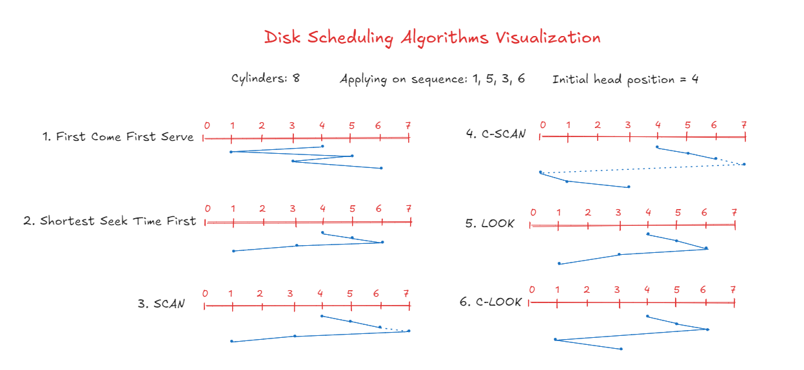

# Disk Scheduling Algorithms Simulator



This repository implements various disk scheduling algorithms in C++ to simulate and compare their performance. The program simulates a disk with 5,000 cylinders and processes 1,000 random cylinder requests using different scheduling algorithms. I made it as a part of programming exercises from <a href="https://www.amazon.com/s?k=9781118063330&i=stripbooks&linkCode=qs">Operating Systems Concepts 9th edition book.</a>

## Implemented Algorithms

1. **FCFS** (First Come First Serve)
2. **SSTF** (Shortest Seek Time First)
3. **SCAN** (Elevator Algorithm)
4. **C-SCAN** (Circular SCAN)
5. **LOOK** (SCAN variation)
6. **C-LOOK** (C-SCAN variation)

## Repository Structure

```plaintext
Disk-Scheduling-Algorithms/
├── src/
│   ├── main.cpp (contains driver program)
│   ├── DiskScheduler.cpp (class definition and functions implementations)
├── .gitignore
├── README.md
```

## Algorithms Descriptions

1. **FCFS**: The simplest disk scheduling algorithm. It serves requests in the order they arrive, without any reordering.
2. **SSTF**: Selects the request that is closest to the current head position, minimizing seek time.
3. **SCAN**: The disk arm moves in one direction, servicing all requests until it reaches the end of the disk, then reverses direction.
4. **C-SCAN**: Similar to SCAN, but when the end of the disk is reached, the arm jumps back to the beginning and continues servicing requests in the same direction.

## Notes

- The random requests are generated once and used for all algorithms to ensure fair comparison
- Head movement is calculated as the absolute difference between consecutive positions
- The program validates the initial head position (must be 0-4999)

⭐ Star if you find it useful!
